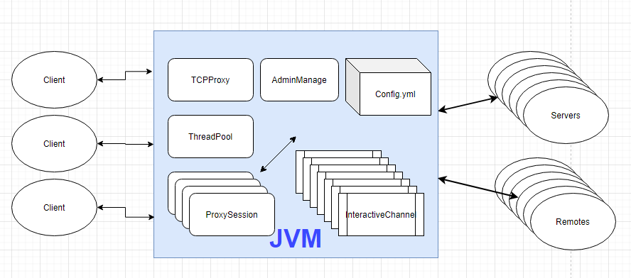
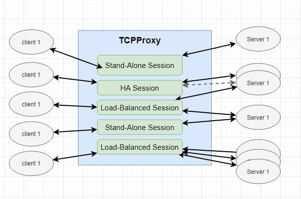
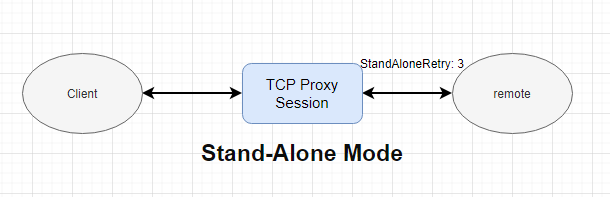
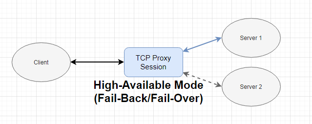
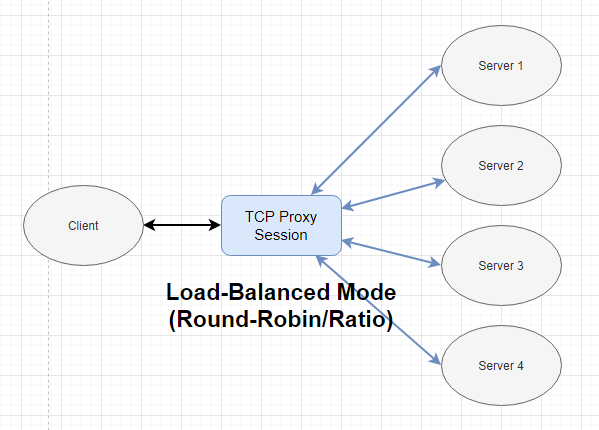

# TCPProxy v1.0.0
---  
  


## Instroduction
TCPProxy is Open Source Project that can contributes to relay TCP connection or being role of Stalend-Alone / HA / Load-Balanced Cluster Proxy Server.  
It is based on TCP Socket layer transportation which is usually used in most Application / Web / OS / Device of present day.  
The TCPProxy is written by Java but It can support most TCP connection of a Application written with any programming language.  
It's very working simple, instinctive, performanceful. Most of user can easily set configuration, deloying, execution.  
You can construct secure entry point proxy to connect spawn of servers with TCPProxy.  
Also can make Stand-Alone, HA or Load-Balanced Architecture at front of your servers.  


## Structure
---  
  
TCPProxy is run on JVM. It consist of proxy main frame, thread pool, sessions for services and configuration YAML config file.  
The main frame part performs to manage each Sessions and configuration. A session be charged to interact between clients and remotes(servers) is worked with a session mode specified in config.yml. e.g. STAND_ALONE, HIGI_AVAILABLE_FAIL_OVER, HIGI_AVAILABLE_FAIL_BACK, LOAD_BALANCE_ROUND_ROBIN, LOAD_BALANCE_SEPARATE_RATIO.  
Each sessions have a thread pool to process client's requests which is needed to interct with remotes(or servers).  
Actual transporting is processed at a channel in Session, Also it is worked as a thread with two way as send and receive channel.  

  
TCPProxy can allow a lot of clients and can manage various kind of sessions.  
Various sessions is working and processing client requests concurrently. User can set a detail configuration in config.yml to manage or maintaining each sessions for performance.  


## Example of config.yml
---
```yml
adminPassword: null   //Not supported now
adminPort: 9292   //Not supported now
adminUser: null   //Not supported now
forbiddenRemote: [   //Define forbidden remotes as global accessible filter
  ]
proxyHost: localhost   //TCPProxy bind address
sessionMapping:
  MySQL:
    allowedHosts: [192.168.1.42]   //Allowed client addresses excluded port. To empty this list is to allow all clients.
    threadPoolCoreSize: 10   //Thread pool default size
    threadPoolMaxSize: 50   //Thread pool maxinum size
    threadPoolIdleSecond: 600   //Thread pool idle seconds when not working
    threadPoolQueueSize: 30   //Thread pool waiting queue size
    bufferSize: 0   //Buffer size in channel. 0 is to be 1024
    connectionTimeout: 3   //Remote socket connection timeout
    keepAlive: false   //Socket keep alive value
    proxyBindAddress: localhost   //Session server socket bind address. if your host don't use multi network interfaces, leave this value default.
    proxyPort: 1212   //Port number for this session. It have to be different value at each session, otherwise it can be occuring 'Bind Exception'.
    remoteHosts: [192.168.1.152:9022]   //Remote host address included port. Session mode is 'STAND_ALONE' so the remoteHosts can has only one address of remote.
    sessionMode: STAND_ALONE   //Session mode
    standAloneRetry: 3   //Times of retry to remote when stand-alone mode
    loadBalanceRatio:    //Ratio of each remote if when session mode is 'LOAD_BALANCE_SEPARATE_RATIO'
    failedCircularRetry: 3   //Ignore this value
    soTimeout: 0   //Remote socket so_timeout value
    tcpNoDelay: false   //Remote socket tcp_no_delay value
  Kafka:
    allowedHosts: []
    threadPoolCoreSize: 20
    threadPoolMaxSize: 50
    threadPoolIdleSecond: 600
    threadPoolQueueSize: 30
    bufferSize: 0
    connectionTimeout: 0
    keepAlive: false
    proxyBindAddress: localhost
    proxyPort: 1213
    remoteHosts: [192.168.1.152:8092, 192.168.1.153:8092]
    sessionMode: HIGI_AVAILABLE_FAIL_BACK
    standAloneRetry: 3
    loadBalanceRatio: 
    failedCircularRetry: 3
    soTimeout: 0
    tcpNoDelay: false
  Oracle:
    allowedHosts: [127.0.0.1]
    threadPoolCoreSize: 10
    threadPoolMaxSize: 50
    threadPoolIdleSecond: 600
    threadPoolQueueSize: 30
    bufferSize: 0
    connectionTimeout: 3
    keepAlive: false
    proxyBindAddress: localhost
    proxyPort: 1214
    remoteHosts: [192.168.1.157:1521, 192.168.1.155:1521, 192.168.1.156:1521, 192.168.1.158:1521]   //Four remote cluster host.
    sessionMode: LOAD_BALANCE_SEPARATE_RATIO
    standAloneRetry: 3
    loadBalanceRatio: 10:20:30:50   //Must define 4 ratio values as 4 remote host is defined in 'remoteHosts' field.
    failedCircularRetry: 6
    soTimeout: 0
    tcpNoDelay: false
```


## Configuration for each session mode
---  
  


  


  

