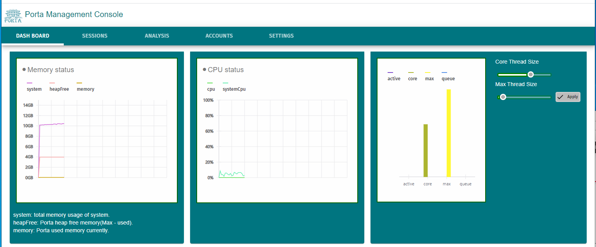

# TCPProxy v1.1.0
---  
  

## Notification
---
- <del>Dec, 2020 - On working that TCPProxy management GUI is based on ReactJS. Improving management handling. To launch at Feb, 2021.</del>
- <del>Feb 25, 2021 - TCPProxy will be remained as Daemon Application. and It will be going to be React Web App named as 'Porta' on GitHub at almost last of May.</del>
- July 18, 2021 - Porta would be launching in some future months. It's too delayed up and it's because of hard and tough thing that I faced. All things of this about it is responsibility of author. I am very sorry for this. Util latest dev capture is below.  

 

## Instroduction
TCPProxy is Open Source Project that can contributes to relay TCP connection or being role of Stalend-Alone / HA / Load-Balanced Cluster Proxy Server. It is based on TCP Socket layer transportation which is usually used in most Application / Web / OS / Device of present day.  
The TCPProxy is written by Java but It can support most TCP connection of a Application written with any programming language.  
It's very working simple, instinctive, performanceful. Most of user can easily set configuration, deloying, execution.  
You can construct secure entry point proxy to connect spawn of servers with TCPProxy.  
Also can make Stand-Alone, HA or Load-Balanced Architecture at front of your servers.  


## Structure
---  
  
TCPProxy is run on JVM. It consist of proxy main frame, thread pool, sessions for services and configuration YAML config file.  
The main frame part performs to manage each Sessions and configuration. A session be charged to interact between clients and remotes(servers) is worked with a session mode specified in config.yml. 
Each sessions have a thread pool to process client's requests which is needed to interct with remotes(or servers).  
Actual transporting is processed at a channel in Session, Also it is worked as a thread with two way as send and receive channel.  

### Session mode  
**1. STAND_ALONE** - A session for stand-alone remote(server). This mode contribute to only one remote target. See more to bottom of document.   
**2. HIGI_AVAILABLE_FAIL_OVER** - A session for HA(High-Available) structure. With this mode, user can compose HA Fail-Over architecture. if all remote fail, service is to be over.    
**3. HIGI_AVAILABLE_FAIL_BACK** - A session for HA(High-Available) Fail-Back architecture. if failed Master be alived, service will be recovered.    
**4. LOAD_BALANCE_ROUND_ROBIN** - A session for Load-Balance service with the way of Round-Robin algorithm. user can compose cluster back-end with this mode of TCPProxy.    
**5. LOAD_BALANCE_SEPARATE_RATIO** - A session for Load-Balance service with the way of assigned ratio. This mode can control throughput of requests to each remote target.    

  
TCPProxy can allow a lot of clients and can manage various kind of sessions.  
Various sessions is working and processing client requests concurrently. User can set a detail configuration in config.yml to manage or maintaining each sessions for performance.  


## Example of config.yml
---
```yml
managementActivation: true
managementAddress: localhost
managementPort: 3232
credentialPath: ./credentials.yml
proxyThreadPoolCoreSize: 10 //Thread pool default size
proxyThreadPoolMaxSize: 50  //Thread pool maxinum size
proxyThreadPoolIdleSecond: 600  //Thread pool idle seconds when not working
proxyThreadPoolQueueSize: 30  //Thread pool waiting queue size
sessionMapping:
  mysql:
    allowedHosts: [127.0.0.1]   //Allowed client addresses excluded port. To empty this list is to allow all clients.
    forbiddenHosts: []
    bufferSize: 0   //Buffer size in channel. 0 is to be 1024
    connectionTimeout: 5   //Remote socket connection timeout
    keepAlive: false   //Socket keep alive value
    proxyBindAddress:  localhost   //Session server socket bind address. if your host don't use multi network interfaces, leave this value default.
    proxyPort: 9336   //Port number for this session. It have to be different value at each session, otherwise it can be occuring 'Bind Exception'.
    remoteHosts: [192.168.1.157:9336, 192.168.1.157:9336, 192.168.1.157:9336]    //Remote host address included port. Session mode is 'STAND_ALONE' so the remoteHosts can has only one address of remote.
    sessionMode: LOAD_BALANCE_ROUND_ROBIN   //Session mode
    standAloneRetry: 3   //Times of retry to remote when stand-alone mode
    loadBalanceRatio:    //Ratio of each remote if when session mode is 'LOAD_BALANCE_SEPARATE_RATIO' 
    failedCircularRetry: 3   //Ignore this value
    soTimeout: 0   //Remote socket so_timeout value
    tcpNoDelay: false   //Remote socket tcp_no_delay value
  kafka:
    allowedHosts: [127.0.0.1]
    forbiddenHosts: []
    bufferSize: 0
    connectionTimeout: 0
    keepAlive: false
    proxyBindAddress: localhost
    proxyPort: 8092
    remoteHosts: [192.168.1.152:8092]
    sessionMode: STAND_ALONE
    standAloneRetry: 3
    loadBalanceRatio: 
    failedCircularRetry: 3
    soTimeout: 0
    tcpNoDelay: false
  oracle:
    allowedHosts: [127.0.0.1]
    forbiddenHosts: []
    bufferSize: 0
    connectionTimeout: 3
    keepAlive: true
    proxyBindAddress: localhost
    proxyPort: 1521
    remoteHosts: [192.168.1.157:1521]
    sessionMode: STAND_ALONE
    standAloneRetry: 3
    loadBalanceRatio: 
    failedCircularRetry: 6
    soTimeout: 60000
    tcpNoDelay: true
```


## How to work on session mode
---  

1. Stand-Alone session mode  
Stand-Alone mode provide to relay client connections to single remote or server. As it can relay a connection, user can connect a not direct connected remote with this session mode. For example, User can request to remote RDBMS which couldn't reach direct being caused by firewall, security reason by this session.  
In General, client and remote is single pair structue and if remote host connection be failed, it can retry to connect to remote with ***standAloneRetry*** session configuration.  

* How to configurate on config.yml
```yaml
proxyBindAddress: localhost //Network interface address will be bounded with this Session.
proxyPort: 1212 //Port with above address.
remoteHosts: [192.168.1.152:9022] //Target remote host address and port. host:port format. You have to define just one host:port.
sessionMode: STAND_ALONE //This Session mode.
standAloneRetry: 3 //Retry count when connecting failed.
```

  


2. HA(High-Available) session mode
HA mode provide two way of working method to support High-Available service. User can compose HA service architecture with this mode.  
One is Fail-Over, the other is Fail-Back. All of method should be to have Master and Slave remote. In Fail-Over method, Ones the Master be failed, Slave be going to work alternatively and when if Slave would be failed also, the service will be disabled.  
And in fail-back method, if the Master be failed, Slave be going to work alternatively and then if Master is back to be recovered, the service will be continued on Master.  

* How to configurate on config.yml
```yaml
proxyBindAddress: localhost
proxyPort: 1213
remoteHosts: [192.168.1.152:8092, 192.168.1.153:8092]  //You can have to define just two remote.
sessionMode: HIGI_AVAILABLE_FAIL_BACK  //or HIGI_AVAILABLE_FAIL_BACK
```

  


3. Load-Balance session mode
User can compose a service with multiple remotes or servers like Cluster Service. Also user can configurate various options about this session mode.  
Basically, Load-Balance mode provide two way of working method to apply request distribution algorithm. One method is Round-Robin and the other is Assigned-Ratio. Round-Robin is process client requests to assign remotes through equality rate sequentially. If remote be failed on it's turn, next assigned remote be working alternatively.  
Assigned-Ratio is processing clients requests to assign remotes through specified on ***loadBalanceRatio*** in config. User can set particular ratio at each remote and doing do, each remote can be working with specified ratio. Even if it's able to have different capacity of remote hosts, this option can let them being working efficiently.

* How to configurate on config.yml
```yaml
proxyBindAddress: localhost
proxyPort: 1214
remoteHosts: [192.168.1.157:1521, 192.168.1.155:1521, 192.168.1.156:1521, 192.168.1.158:1521]   //You can define multiple host:port what you want to load-balance on this Session.
sessionMode: LOAD_BALANCE_SEPARATE_RATIO  //or LOAD_BALANCE_ROUND_ROBIN
loadBalanceRatio: 10:20:30:50   //You have to define ratios just only as much as defined hosts above.
```

  


## How to be expressed your thinking in this project
---
If you have any problem when you were using, or encountered to be met something to improve on TCPProxy, Please let us know using Issue tab.  
Also If you want to join contributing TCPProxy, you just write and send your profile on Issue tab which title is as "Contribution application", So then we will reply result of qualification of contribution through Issue board.


